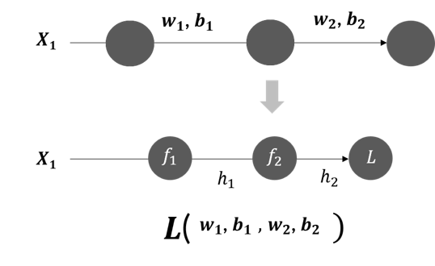

Introduction to Backpropagation
In the previous module on Introduction to Neural Networks - Part 1, you learnt how information flows through a neural network in the forward direction.

 

In this Module
In this module, you will learn how to train a neural network using backpropagation, apply different optimisation techniques, perform hyperparameter tuning etc.  You will also learn the practical aspects of training large neural networks.

 

In this Session
In this session, you will learn about the process of training neural networks, which is called backpropagation.

Here, the following topics will be covered:

Gradient descent in neural networks
Backpropagation algorithm
Introduction to TensorFlow
Implementation of a neural network using TensorFlow
 

# Gradient Descent for Backpropagation
In the previous session, you learnt that training refers to the task of finding the optimal combination of weights and biases to minimize the total loss (with a fixed set of hyperparameters).  

This optimization is achieved using the familiar gradient descent algorithm.

 

For a neural network, you will learn how the loss function is minimized using the gradient descent function by finding the optimum values of weights and biases using backpropagation. In the next video, you will learn how backpropagation works.

In this video, you learnt that the gradient descent algorithm presents us with the following parameter update equation:

wlkj=wlkj − η∂L/∂wlkj

where 
k
 and 
j
 are the indices of the weight in the weight matrix and 
l
 is the index of the layer to which it belongs.

 Given the neural network in the diagram, for the output layer, the following weights and bias terms will be updated using the gradient descent update equation:

 

w211=w211−η∂L∂w211

w212=w212−η∂L∂w212

b21=b21−η∂L∂b21

Now, for the hidden layer, the following weight and biases will be updated:

 

w
1
11
=
w
1
11
−
η
∂
L
∂
w
1
11
                               
w
1
21
=
w
1
21
−
η
∂
L
∂
w
1
21

w
1
12
=
w
1
12
−
η
∂
L
∂
w
1
12
                                
w
1
22
=
w
1
22
−
η
∂
L
∂
w
1
22

b
1
1
=
b
1
1
−
η
∂
L
∂
b
1
1
                                 
b
1
2
=
b
1
2
−
η
∂
L
∂
b
1
2

 

To compute these gradients, we use an algorithm called backpropagation.

As you can see in the formulas above, there exist partial derivatives of the loss function 
L
 with respect to the weights and biases in these equations given above. To compute these, we use the chain rule; you can observe the dependencies of different layers in the gradient computation.

 

Now, let’s simplify the neural network given above and represent it in a condensed format - this is shown below.

In this case, the loss function is a function of 
w
1
, 
b
1
, 
w
2
 and 
b
2
.

The loss function, the activation function and the cumulative input are shown in the following expressions:

Loss function: 
L
o
s
s
=
1
2
(
y
−
h
2
)
2

Cumulative Input: 
z
i
=
w
i
h
i
−
1
+
b
i

Output using tanh activation function: 
h
i
=
t
a
n
h
(
z
i
)

Now, let’s compute the gradient of the loss function with respect to one of the weights to understand how backpropagation works. Suppose we want to calculate 
∂
L
∂
w
2
:

Using the chain rule, we can say that:

∂L∂w2 = ∂L/∂h2 ∂h2/∂z2 ∂z2/∂w2

 

Based on the definition of the loss function, 
L
 is a direct function of 
h
2
, 
h
2
 is a direct function of 
z
2
 and 
z
2
 is a direct function of 
w
2
. Now, in the following video, let’s calculate all of them one by one.

In this video, you saw the following computations of the gradients to compute 
∂
L
∂
w
2
.

We know that 
∂
L
∂
w
2
=
∂
L
∂
h
2
∂
h
2
∂
z
2
∂
z
2
∂
w
2
; let's compute each term present in this expression.

 

First term:

Loss function: 
L
=
1
2
(
y
−
h
2
)
2

Taking the derivative of the loss function 
L
 with respect to 
h
2
: 
∂
L
∂
h
2
=
∂
∂
h
2
1
2
(
y
−
h
2
)
2
=
−
(
y
−
h
2
)
.
.
.
.
(
1
)

 

Second term:

Applying the tanh activation function on the cumulative input 
z
2
 we get 
h
2
:

h
2
=
t
a
n
z
(
z
2
)

Taking the derivative of 
h
2
 with respect to 
z
2
:
∂
h
2
∂
z
2
=
1
−
t
a
n
h
2
(
z
2
)
=
1
−
(
h
2
)
2
.
.
.
.
(
2
)

 

Third term:

Cumulative Input: 
z
2
=
w
2
h
1
+
b
2

Taking the derivative of 
z
2
 with respect to 
w
2
:
∂
z
2
∂
w
2
=
h
1
.
.
.
.
(
3
)

 

Hence, from expressions (1),(2) and (3), we get the gradient of the Loss function 
L
 with respect to 
w
2
, which is shown below.

∂
L
∂
w
2
=
∂
L
∂
h
2
∂
h
2
∂
z
2
∂
z
2
∂
w
2
=
[
−
(
y
−
h
2
)
]
[
1
−
(
h
2
)
2
]
[
h
1
]

 

Now, we have completed the computation of the gradient of the loss function 
L
 with respect to the weight 
w
2
 for backpropagation. We can similarly compute the gradient of the loss function with respect to all the weights and biases present in the network.

In the next video, we will observe the iterative nature of the computation of the gradients for multiple hidden layers.

Once the gradients of all the weights and biases are computed, the gradient descent update equation can be used to obtain the updated values of the weights and biases.

 

 

Before proceeding to the next segment, attempt the following question to deepen your understanding of backpropagation. Please write down the equations referring to the theory discussed in this segment when attempting this question.

Question 1
Consider a sample neural network given below:

 

Let's say that the predicted output 
h
2
=
σ
(
z
2
)
 i.e., the sigmoid activation function is used. The actual output is y. Find the expression for 
∂
L
∂
w
2
. You can refer to the steps covered in the theory of this segment to obtain the expression for 
∂
L
∂
w
2
.

Note: 
∂
h
2
∂
z
2
=
h
2
(
1
−
h
2
)
 i.e., derivative of the sigmoid activation function.

 ==>

 [
−
(
y
−
h
2
)
]
[
h
2
(
1
−
h
2
)
]
[
h
1
]

✓ Correct
Feedback:
Using the chain rule equation, 
∂
L
∂
w
2
=
∂
L
∂
h
2
∂
h
2
∂
z
2
∂
z
2
∂
w
2

 

Loss function: 
L
=
1
2
(
y
−
h
2
)
2

Taking the derivative with respect to 
h
2
: 
∂
L
∂
h
2
=
∂
∂
h
2
1
2
(
y
−
h
2
)
2
=
−
(
y
−
h
2
)

 

Applying the sigmoid activation function on the cumulative input 
z
2
 we get 
h
2
: 
h
2
=
σ
(
z
2
)

Taking the derivative of 
h
2
 with respect to 
z
2
: 
∂
h
2
∂
z
2
=
h
2
(
1
−
h
2
)

 

Cumulative Input: 
z
2
=
w
2
h
1
+
b
2

Taking the derivative of 
z
2
 with respect to 
w
2
:
∂
z
2
∂
w
2
=
h
1

 

Hence, gradient of the Loss function 
L
 with respect to 
w
2
 is: 

∂
L
∂
w
2
=
∂
L
∂
h
2
∂
h
2
∂
z
2
∂
z
2
∂
w
2
=
[
−
(
y
−
h
2
)
]
[
h
2
(
1
−
h
2
)
]
[
h
1
]

Now that you have learnt about backpropagation in a simple network. Let’s proceed to the next segment to apply the technique of backpropogation to a numerical example

---

# Numerical Example Demonstrating Backpropagation

You gained an understanding of the backpropagation technique on a very simple neural network. You will now learn how the weights and biases, i.e., the parameters of the neural network considered for the house price prediction example, change. 

 
The housing data set has two inputs, which are the size of the house and the number of rooms available, and one output, 
which is the price of the house.

 
As seen in the computation of the forward pass, we randomly initialise the weights and biases in the network. 
Let’s take the same initialisation and the same input observation that we used earlier while doing forward propagation.

Note: Solve these equations using pen and paper for better understanding. Do keep in mind that understanding how backpropagation works takes time and effort and it may take a few repetitions to understand it well. Please be patient!

 

So, we initialised the parameters to the values shown below when doing forward propagation. We will use the same values when doing backpropagation. Also, we will consider the same input observation. The values of the weights, biases and the input are as follows:

Weights:

W1=[w111w112w121w122]
=
[0.2
0.15
0.5
0.6
]
W2=[w211w212]
=[0.3
0.2
]

Biases:

b1=[b11b12]
=
[0.1
0.25
]
b2
=[
b2
1]
=[
0.4
]

Input data:
 
X1=[x1x2]
=
[−
0.32
−
0.66
]

The network architecture we consider is shown below:

As we have calculated previously, the output prediction 
h21  obtained is 0.63, whereas the actual output y
 is −0.54. Using backpropagation, we will update the weights and biases such that this difference between the predicted and the actual output gets minimised.

Now, let’s revise the notations of some terms:

h2 is the final predicted output that is obtained by applying the activation function (in this case, linear) on the cumulative input. 

z2 is the cumulative input fed to the output neuron.

W2 and 
b2 are the weights and biases between the hidden layer and the output layer.

h1 is the output of the hidden layer.

z1 is the cumulative input to the hidden layer.

W1 and b1 are the weights and biases of the hidden layer, respectively.

X1 is the input from the housing data set.

We will only focus on updating the weights and biases in this network. 

We strongly recommend that you perform the calculations yourself along with Gunnvant to grasp the concepts efficiently.

Note: At timestamp 3:32, Gunnvant mentioned that “we can use the gradient descent update equation to get the updated value of the error term”. It is not the updated value of the error term but the updated value of the weight term 
w211 .

As seen in the video, the steps taken to update the weights and biases between the hidden layer and the output layer are shown below.'

First, we will focus on the weights for the output layer.

 

Output Layer: Compute gradient of 
L
 with respect to 
w
2
11
:

 

First, let’s take the gradient of 
L
 with respect to 
w
2
11
.
We know that:
∂
L
∂
w
2
11
=
∂
L
∂
h
2
1
∂
h
2
1
∂
z
2
1
∂
z
2
1
∂
w
2
11
(using the chain rule)

 

1) First term 
∂
L
∂
h
2
1
:

 
∂
L
∂
h
2
1
=
∂
∂
h
2
1
1
2
(
y
−
h
2
1
)
2
=
−
(
y
−
h
2
1
)

∂
L
∂
h
2
1
=
−
(
−
0.54
−
0.63
)
=
1.17

 

2) Second term 
∂
h
2
1
∂
z
2
1
: 

 
∂
h
2
1
∂
z
2
1
=
1
 as 
h
2
1
=
z
2
1
 (using linear activation function)

 

3) Third term:

∂
z
2
1
∂
w
2
11
=
∂
∂
w
2
11
1
2
(
b
2
1
+
w
2
11
h
1
1
+
w
2
12
h
1
2
)

 
∂
z
2
1
∂
h
2
1
=
(
h
1
1
)
=
0.484

 

Hence, 
∂
L
∂
w
2
11
 evaluates to 
∂
L
∂
w
2
11
=
1.17
∗
1
∗
0.484
=
0.5663

 

Now, using the update rule for gradient descent and considering the learning rate 
η
 as 0.2.
w
2
11
(
u
p
d
a
t
e
d
)
=
w
2
11
−
η
∂
L
∂
w
2
11
=
0.3
−
(
0.2
∗
0.5663
)
=
0.1867

 

 

Output Layer: Compute gradient of 
L
 with respect to 
w
2
12
:

 

Similarly 
∂
L
∂
w
2
12
=
∂
L
∂
h
2
1
∂
h
2
1
∂
z
2
1
∂
z
2
1
∂
w
2
12

Since we have already computed the first two derivatives, let’s compute the third one:

 

∂
z
2
1
∂
w
2
12
=
(
h
2
1
)
=
0.424

Hence, this evaluates to 
∂
L
∂
w
1
12
=
1.17
∗
1
∗
0.424
=
0.4961

 

Now, using gradient descent update equation,

w
2
12
(
u
p
d
a
t
e
d
)
=
w
2
12
−
η
∂
L
∂
w
2
12
=
0.2
−
(
0.2
∗
0.4961
)
=
0.1008

 

Similarly, for the bias term, we know that:
∂
L
∂
b
2
1
=
∂
L
∂
h
2
1
∂
h
2
1
∂
z
2
1
∂
z
2
1
∂
b
2
1

 

We have computed the first two derivatives already, and the third one can be computed as shown below: 

∂
z
1
2
∂
b
2
1
=
∂
∂
b
2
1
(
b
2
1
+
w
2
11
h
1
1
+
w
2
12
h
1
2
)

∂
z
1
2
∂
b
2
1
=
1

 

Hence, this evaluates to, 

∂
L
∂
b
2
1
=
1.17
∗
1
∗
1
=
1.17

Now,

b
2
1
(
u
p
d
a
t
e
d
)
=
b
2
1
−
η
∂
L
∂
b
2
1
=
0.4
−
(
0.2
∗
1.17
)
=
0.166

 

So, we have updated values of weights and biases of the output layer from a single iteration:

w
2
11
(
u
p
d
a
t
e
d
)
=
0.1867
,
w
2
12
(
u
p
d
a
t
e
d
)
=
0.1008
,
b
2
1
(
u
p
d
a
t
e
d
)
=
0.166

 

In the next video, we will move to the previous layer, and you will learn how to update the weights and biases of the first layer (hidden layer). 

As seen in this video, the steps involved in computing the updated weights and biases in the hidden layer are shown below. 

Now, let’s start with computing the weights and biases corresponding to the first neuron of the hidden layer.

Hidden Layer: Compute gradient of 
L
 with respect to 
w
1
11
:
Taking the gradient of L with respect to 
w
1
11
, we can say that:

∂
L
∂
w
1
11
=
∂
L
∂
h
2
1
∂
h
2
1
∂
h
1
1
∂
h
1
1
∂
w
1
11
=
∂
L
∂
h
2
1
∂
h
2
1
∂
h
1
1
[
∂
h
1
1
∂
z
1
1
∂
z
1
1
∂
w
1
11
]

 

We know the first derivative term: 

∂
L
∂
h
2
1
=
∂
∂
h
2
1
1
2
(
y
−
h
2
1
)
2
=
−
(
y
−
h
2
1
)
=
−
(
−
0.54
−
0.63
)
=
1.17

 

Now, let’s compute the second, third and fourth derivative terms:

1) 
∂
h
2
1
∂
h
1
1
=
∂
∂
h
1
1
(
b
2
1
+
w
2
11
h
1
1
+
w
2
12
h
1
2
)
=
w
2
11
=
0.30

2) 
∂
h
1
1
∂
z
1
1
=
σ
(
z
1
1
)
(
1
−
σ
(
z
1
1
)
)
=
h
1
1
(
1
−
h
1
1
)
=
0.484
(
1
−
0.484
)
 (Considering a sigmoid activation function)

3) 
∂
z
1
1
∂
w
1
11
=
∂
∂
w
1
11
(
b
2
1
+
w
1
11
x
1
+
w
1
12
x
2
)
=
x
1
=
−
0.32

 

Hence, this evaluates to 
∂
L
∂
w
1
11
=
1.17
∗
0.30
∗
0.484
∗
(
1
−
0.484
)
∗
(
−
0.32
)
=
−
0.028

 

Now, using the gradient descent update equation,

w
1
11
(
u
p
d
a
t
e
d
)
=
w
1
11
−
η
∂
L
∂
w
1
11
=
0.2
−
0.2
∗
(
−
0.028
)
=
0.2056

 

 

Hidden Layer: Compute gradient of 
L
 with respect to 
w
1
12
:

 

Similarly, 
∂
L
∂
w
2
12
=
∂
L
∂
h
2
1
∂
h
2
1
∂
h
1
1
∂
h
1
1
∂
w
1
12
=
∂
L
∂
h
2
1
∂
h
2
1
∂
h
1
1
[
∂
h
1
1
∂
z
1
1
∂
z
1
1
∂
w
1
12
]

Since we have already computed the values of the first three terms, we simply need to calculate the pending derivative term: 

∂
z
1
1
∂
w
1
12
=
∂
∂
w
1
12
(
b
1
1
+
w
1
11
x
1
+
w
1
12
x
2
)
=
x
2
=
−
0.66

 

Hence, this evaluates to

∂
L
∂
w
1
12
=
1.17
∗
0.30
∗
0.484
∗
(
1
−
0.484
)
∗
(
−
0.66
)
=
−
0.058

 

Now, using the gradient descent update equation,

w
1
12
(
u
p
d
a
t
e
d
)
=
w
1
12
−
η
∂
L
∂
w
1
12
=
0.15
−
0.2
∗
(
−
0.058
)
=
0.1616

 

 

Hidden Layer: Compute gradient of 
L
 with respect to 
b
1
12
:

∂
L
∂
b
1
1
=
∂
L
∂
h
2
1
∂
h
2
1
∂
h
1
1
[
∂
h
1
1
∂
z
1
1
∂
z
1
1
∂
b
1
12
]

Consider the last term on the right-hand side of the equation above:

∂
z
1
1
∂
b
1
1
=
∂
∂
b
1
1
(
b
1
1
+
w
1
11
x
1
+
w
1
12
x
2
)
=
1

Hence, this evaluates to 
∂
L
∂
b
1
1
=
1.17
∗
0.30
∗
0.484
∗
(
1
−
0.484
)
∗
1
=
0.088

 

Now, using the gradient descent update equation,

b
1
1
(
u
p
d
a
t
e
d
)
=
b
1
1
−
η
∂
L
∂
b
1
1
=
0.1
−
0.2
∗
(
0.088
)
=
0.0824

 

Hence, for the first node, the updated values of the weights and biases using gradient descent and a learning rate of 0.2 (η) are:

w
1
11
(
u
p
d
a
t
e
d
)
=
w
1
11
−
η
∂
L
∂
w
1
11
=
0.2
−
0.2
∗
(
−
0.028
)
=
0.2056

w
1
12
(
u
p
d
a
t
e
d
)
=
w
1
12
−
η
∂
L
∂
w
1
12
=
0.15
−
0.2
∗
(
−
0.058
)
=
0.1616

b
1
1
(
u
p
d
a
t
e
d
)
=
b
1
1
−
η
∂
L
∂
b
1
1
=
0.1
−
0.2
∗
(
0.088
)
=
0.0824

 

In the same manner, we calculate the weights and biases corresponding to the second neuron in the hidden layer.

Hidden Layer: Compute gradient of 
L
 with respect to 
w
1
21
:

Starting with finding the derivative of the loss function 
L
 with respect to 
w
1
21
:

∂
L
∂
w
1
21
=
∂
L
∂
h
2
1
∂
h
2
1
∂
h
1
2
∂
h
1
2
∂
w
1
21
=
∂
L
∂
h
2
1
∂
h
2
1
∂
h
1
2
[
∂
h
1
2
∂
z
1
2
∂
z
1
2
∂
w
1
21
]

We have already computed the first derivative term:

∂
L
∂
h
2
1
=
∂
∂
h
2
1
1
2
(
y
−
h
2
1
)
2
=
−
(
y
−
h
2
1
)
=
−
(
−
0.54
−
0.63
)
=
1.17

 

Let’s compute the second, third and fourth terms:

1) 
∂
h
2
1
∂
h
1
2
=
∂
∂
h
1
2
(
b
2
1
+
w
2
11
h
1
1
+
w
2
12
h
1
2
)
=
w
2
12
=
0.20

2) 
∂
h
1
2
∂
z
1
2
=
σ
(
z
1
2
)
(
1
−
σ
(
z
1
2
)
)
=
h
1
2
(
1
−
h
1
2
)
=
0.424
(
1
−
0.424
)

3)
∂
z
1
2
∂
w
1
21
=
∂
∂
w
1
21
(
b
2
1
+
w
1
21
x
1
+
w
1
22
x
2
)
=
x
1
=
−
0.32

 

Also, for 
w
1
22
 and 
b
1
2
, the first three terms will remain the same, only the last term will change. Hence, we will compute only the last terms: 

∂
z
1
2
∂
w
1
22
=
∂
∂
w
1
22
(
b
1
2
+
w
1
21
x
1
+
w
1
22
x
2
)
=
x
2
=
−
0.66

∂
z
1
2
∂
b
1
2
=
∂
∂
b
1
2
(
b
1
2
+
w
1
21
x
1
+
w
1
22
x
2
)
=
1

 

Hence, for the second node:

∂
L
∂
w
1
21
=
∂
L
∂
h
2
1
∂
h
2
1
∂
h
1
1
[
∂
h
1
1
∂
z
1
1
∂
z
1
2
∂
w
1
21
]
=
1.17
∗
0.20
∗
0.424
∗
(
1
−
0.424
)
∗
(
−
0.32
)
=
−
0.018

∂
L
∂
w
1
22
=
∂
L
∂
h
2
1
∂
h
2
1
∂
h
1
1
[
∂
h
1
1
∂
z
1
1
∂
z
1
2
∂
w
1
22
]
=
1.17
∗
0.20
∗
0.424
∗
(
1
−
0.424
)
∗
(
−
0.32
)
=
−
0.038

∂
L
∂
b
1
2
=
∂
L
∂
h
2
1
∂
h
2
1
∂
h
1
1
[
∂
h
1
1
∂
z
1
1
∂
z
1
2
∂
b
1
2
]
=
1.17
∗
0.20
∗
0.424
∗
(
1
−
0.424
)
∗
1
=
−
0.057

 

Now, computing the updated values of weights and biases using gradient descent and a learning rate of 0.2 (
η
):

 

w
1
11
(
u
p
d
a
t
e
d
)
=
w
1
21
−
η
∂
L
∂
w
1
21
=
0.5
−
0.2
∗
(
−
0.018
)
=
0.5036

w
1
22
(
u
p
d
a
t
e
d
)
=
w
1
22
−
η
∂
L
∂
w
1
22
=
0.6
−
0.2
∗
(
−
0.038
)
=
0.6076

b
1
2
(
u
p
d
a
t
e
d
)
=
b
1
2
−
η
∂
L
∂
b
1
2
=
0.25
−
0.2
∗
(
−
0.57
)
=
0.2386

 

To summarise, using gradient descent in backpropagation, we can update the weights and biases of the whole neural network. 

 

Given below are the new values for weights and biases after one step of gradient descent for the hidden and the output layer, respectively.

 

Updated weights:

w
1
(
u
p
d
a
t
e
d
)
=
[
w
1
11
(
u
p
d
a
t
e
d
)
w
1
11
(
u
p
d
a
t
e
d
)
w
1
21
(
u
p
d
a
t
e
d
)
w
1
22
(
u
p
d
a
t
e
d
)
]
=
[
0.2056
0.1616
0.5036
0.6076
]
w
2
(
u
p
d
a
t
e
d
)
=
[
w
2
22
(
u
p
d
a
t
e
d
)
w
2
12
(
u
p
d
a
t
e
d
)
]
=
[
0.1867
0.1008
]

Updated biases:

[
b
1
1
(
u
p
d
a
t
e
d
)
b
1
2
(
u
p
d
a
t
e
d
)
]
=
[
0.0824
0.2386
]
[
b
2
1
(
u
p
d
a
t
e
d
)
]
=
[
0.166
]

 

Forward Pass with updated parameters

Now, let’s perform another forward pass and check if performing backpropagation and updating the weights and biases once has helped in reducing the loss.

You can see that the loss function computed on the updated weights and biases is lower than earlier, which is what we want. By repeatedly performing backpropagation to get optimum values of weights and biases, we can continue reducing the loss. This, eventually, will help us obtain the predicted output that is as close as possible to the actual expected output. This is how a neural network learns using backpropagation.

Since this is a simple neural network, you could compute these values manually. But as the number of hidden layers and of neurons per hidden layer increase, computing these values manually will not be possible. The machine will perform these computations. The aim of considering this example is to demonstrate how a basic neural network behaves so that you can extrapolate the ideas learnt in this simple example to larger networks.

 

Now that you have an in-depth understanding of how weights and biases are optimised using the loss function and gradient descent through the neural network, we will now cover a generalised step-by-step algorithm to summarise backpropagation

Feedback:
There will be lesser change in the weights and biases as we know that the weights and biases are updated using gradient descent formula, 
Wlkj=Wkjl−η∂L∂Wlkj
And 
∂L∂Wlkj
is dependent upon 
(h0−y) where 
h0 is the predicted output and 
y is the actual output. If 
h0 is closer to 
y, the step 
(−
η
∂
L
∂
W
l
k
j
)
 will be small hence bringing in lesser change in the weights and biases.

Now, you have an in-depth understanding of how weights and biases are optimised using the loss function and gradient descent through the neural network. In the next segment, we will cover a generalised step-by-step algorithm to summarise backpropagation.

## Backpropagation Algorithm

In the previous segment, you learnt how gradient descent is used in learning neural networks. The training is done using backpropagation. We also discussed a detailed numerical example of backpropagation for a single input in a simple neural network.

 

We took the following steps when passing an input through the network: 

1. Forward propagation of the input through the network with random initial values for weights and biases

2. Making a prediction and computing the overall loss

3. Updating model parameters using backpropagation i.e., updating the weights and biases in the network, using gradient descent

4. Forward propagation of the input through the network with updated parameters leading to a decrease in the overall loss 

5. Repeat the process until the optimum values of weights and biases are obtained such that the model makes acceptable predictions

## The pseudocode/pseudo-algorithm is given as follows:

 

1: Initialise with the input 

 

Forward Propagation

2: For each layer, compute the cumulative input and apply the non-linear activation function on the cumulative input of each neuron of each layer to get the output.

3: For classification, get the probabilities of the observation belonging to a class, and for regression, compute the numeric output.

4: Assess the performance of the neural network through a loss function, for example, a cross-entropy loss function for classification and RMSE for regression.

Backpropagation

5: From the last layer to the first layer, for each layer, compute the gradient of the loss function with respect to the weights at each layer and all the intermediate gradients.

6: Once all the gradients of the loss with respect to the weights (and biases) are obtained, use an optimisation technique like gradient descent to update the values of the weights and biases.

 

Repeat this process until the model gives acceptable predictions:

7: Repeat the process for a specified number of iterations or until the predictions made by the model are acceptable. 

 

This is a consolidated algorithm for training a neural network.

 

You will now understand this process through code using TensorFlow. In the next few segments, you will understand the basics of TensorFlow required to implement the forward propagation and backward propagation steps.

Introduction to Tensorflow
In this segment, you will learn about a library called TensorFlow, the knowledge of which will help you build your own neural network with much ease.

 

Please note that we are using Tensorflow primarily to understand what is happening behind the scenes. You are expected to be comfortable with is the high-level API Keras. In the next session, you will learn about Keras. 

 

The objectives for the upcoming segments are given below: 

To learn about the capabilities of TensorFlow as an ML library, which specialises in deep learning

To get an understanding of the coding paradigm of TensorFlow to perform simple coding tasks

To understand the fundamentals of TensorFlow, such as its data structure, tensors, and certain mathematical operations that can be performed using this ML library

 

TensorFlow is an open-source platform for developing end-to-end machine learning (ML) solutions. The TensorFlow platform contains services such as TensorFlow.js, TensorFlow lite, and TensorFlow Extended, which are used to develop applications for browsers, mobile platforms, and large production environments, respectively. 

 

The platform has all the tools needed to build a solution and deploy it on different platforms. One part of the complete TensorFlow environment is the TensorFlow machine learning library, which will be covered in this session. 

TensorFlow is a deep learning library developed by Google. It is used widely in the industry for several different applications. Some of these applications include smart text in Gmail, Google Translate and Google Lens. Now, in the next video, Avishek will discuss TensorFlow and its features.

The features of TensorFlow make it a useful library for ML. In the upcoming segments, you will explore all these features in detail.

## Tensors
A tensor is the fundamental data structure used in TensorFlow. It is a multidimensional array with a uniform data type. The data type for an entire tensor is the same. 

So, what impact does this have on the ML process? 

In the case of data frames, all the raw data, such as integers, strings and floats, can be loaded into a single data frame. So, you could load raw data into a data frame and then process the data to convert it into a numerical form for ML. In the case of tensors, data would need to be loaded into another data structure and processed first. And when you are ready to learn from the data, you can load it into a tensor. 

Now, in the next video, you will learn more about tensors from Avishek.

So, in this video, you learnt that tensors are n-dimensional arrays that are quite similar to NumPy arrays. An important difference between these is their performance. NumPy is a highly efficient library that is designed to work on CPUs. On the other hand, TensorFlow can work on CPUs and GPUs. So, if you have a compatible GPU, then it is highly likely that TensorFlow will outperform NumPy.

In most use cases in ML, you will use either 2D or 3D tensors. A 2D tensor is equivalent to a matrix. It can be used to represent a feature matrix, with each column being a feature and each row being a data point. A 2D tensor would suffice most ML needs. You might want to convert a higher-dimension tensor to a 2D tensor for learning tasks. Recall the ML algorithms covered so far in this course; the data sets for all of them were in a matrix form, where each row represented a data point and each column represented a feature. This is how all algorithms are designed to work. 

You can declare two types of tensors in TensorFlow. In the next video, Avishek will explain this.

Now, let’s summarise the differences between these two types of tensors:

Now, let’s summarise the differences between these two types of tensors:

The values of constant tensors cannot be changed once they are declared but those of variable tensors can be.
 

Constant tensors need to be initialised with a value while they are being declared, whereas variable tensors can be declared later using operations.
 

Differentiation is calculated for variable tensors only, and the gradient operation ignores constants while differentiating. 

Note:  tf.constant is similar to tf.Tensor; both of them have immutable values, but tf.Variable differs from both. Whenever you declare a tensor with tf.constant, it will be an object of the tf.tensor type compared with tf.Variable, which is a different object altogether. You can visit the tf.constant page of the documentation to understand this better.

Now, answer these questions based on what you learnt in this segment.

Question 1
What type of input data will require a tensor with a rank greater than 3?

==>

Video data

✓ Correct
Feedback:
 Videos are made up of continuously changing images. Rank-3 tensors are sufficient to capture information from each image. The fourth dimension will be used to store timestamps.

In the next video, you will learn how to declare tensors in TensorFlow.

You can download the notebook used in this session from the following

Question 2
Which data would you assign to tf.constant?

==>

Learning rate to be used in gradient descent

✓ Correct
Feedback:
The learning rate will remain constant throughout the entire learning stage. It must be loaded in tf.constant.

Actual labels of the data

✓ Correct
You missed this!
Feedback:
Labels will remain constant throughout the entire learning stage. They must be loaded in a tf.constant.

https://colab.research.google.com/drive/1lGOez2MozZeudVQs4zQPyyTiB4aT4Cnf#scrollTo=tj7ywgI79Dkd

In this video, Avishek demonstrated the use of tf.constant to declare tensors. Here are the key observations from the video:

The version of TensorFlow that we use is 2.17.0 for the demonstrations in this module. Ensure that you also use a compatible version when you practise coding. If you get errors while running the code, you can try to import this version of TensorFlow, using the following segment of code:

tf.__version__
#In case another version is present and you are getting errors, uninstall the current version and reinstall version 2.17.0
pip uninstall tensorflow
pip install tensorflow==2.17.0
Three different ranks of tensors were initialised using a list of integer numbers. Note the way in which the tensor with three dimensions was initialised. The two points to note here are: first, the number of square brackets, and second, the use of multiplication. Apart from the brackets needed to declare the 2D array, there is one extra pair of brackets, which tells TensorFlow that the rank of the tensor being initialised is 3. By multiplying the array by 5, the same array was repeated five times to give the values to the rank-3 tensors. Similarly, you can use a single element or a single row of values to create a tensor of your desired dimension.
 

Whenever a tensor is printed, you will notice the following: 

Its values

Its shape

Its data type
 

TensorFlow can autodetect the data type of a tensor based on its values. The following two outcomes can happen if there is variability in the data types of the given values:

The different data types can be combined into one. For example, if a few of the declared numbers are integers and a few are float numbers, then TensorFlow will make all of them floats.

The data types cannot be combined. For example, strings and floats cannot be combined. In such a case, TensorFlow will show an error.

In short, the entire tensor needs to have the same data type. 

 

Now, answer these questions based on what you learnt in this segment.

Q1) 
 Initialising tensors
Which of these is the correct way of initialising a tf.constant tensor ‘p’?

==>

p = tf.constant([1,2,3])

So, in this segment, you learnt about the methods of declaring tensors of different ranks. Nevertheless, all the tensors declared in this segment were of the tf.constant type. In the next segment, you will learn how to declare tf.Variable tensors.

## Declaring Tensors

In the previous segment, you learnt how to declare tensors of the tf.constant type.
In the next video, you will learn about a different way of declaring tensors.

Let’s summarise what was covered in the video: 

You can use tf.Variable in the same way as tf.constant to initialise a tensor with the values that you can pass in a list. However, in the case of variables, these values can be changed later as well.

You can also specify the data type while initialising the tensor. In this way, you can be sure of the data type. Although this might seem trivial now, in the upcoming segments, you will learn about the importance of declaring the data type.

You can access the values of a tensor directly using the .numpy() function. It will return the values of the tensor as a NumPy array. 

So far, you have learnt about many different ways to declare a tensor. Now, open a Google Collab file and try to answer this question.

### Exercise
Declare a tensor of shape (2, 2, 2, 2) with random numbers from a normal distribution whose mean and standard deviation are both 1.

 

First, let’s see how you will get the required tensor using NumPy.

Now, you will learn how to get the required tensor with a mean and standard deviation of 1 using tensorflow directly.

Now, answer these questions based on what you learnt in this segment.

Reading Data with Tensors
Consider an e-commerce data set with these columns: date of purchase, category of purchase, price, quantity, discount and mode of payment. Suppose you are asked to build an ML model using TensorFlow. Which of these actions will you perform?

==>  Read the data into tensors just before training.

 The strength of TensorFlow is in building complex models and learning on huge data sets quickly.

 ## Mathematical Operations on Tensors

 Now that you have understood the basics of tensors, this segment will focus on the mathematical operations that you can perform on them. Since TensorFlow is an ML library, it has all the necessary operations that you might need. In the next video, Avishek will explain the overall mathematical capabilities of TensorFlow. 

 Note: In the video, it is mentioned that the Jupyter Notebook will be used in the demonstration. However, all the demonstrations in this module will be performed using Google Colab.

 So, as you saw in the video, TensorFlow has all the capabilities that you might need for building an ML model. Although the objective of this module is to get you comfortable using TensorFlow, it is not possible to cover all of its mathematical functions and capabilities. In this module, we will discuss the fundamental concepts of coding in TensorFlow, although we strongly recommend you to visit the Tensorflow documentation for better coverage. Now, in the next video, the most basic operations, such as addition and subtraction, will be covered.

 So, as you saw in the video, TensorFlow supports all the basic mathematical operators, and you can call them by simply using the respective operators. To use the operator commands, you need to ensure that both tensors on which the operations are being carried out have the same dimensions. An error will be thrown if their dimensions are not the same because the operations are performed element-wise. Another point to note is that when you divide any number by 0, TensorFlow is smart enough to give the output ‘infinity’. 

The same operations can also be performed using the functions in the TensorFlow library. For example, you can use in place of the addition operator. Similarly, tf.subtract(), tf.multiply() and tf.divide() work exactly as expected. You can visit this page to read about all the available mathematical functions. 

 

Mathematical Operations on Tensors

Q1) Mathematical Operations on Tensors
Write a code in TensorFlow to perform the following task.

Initialise a 2-by-2 tensor with all integer values and then create another tensor by squaring all the elements in the first tensor.

(Note: More than one option may be correct.)

==>

tensor1 = tf.random.uniform((2,2), minval= 1, maxval= 20, dtype= tf.int32)
print("Initial tensor: ", tensor1.numpy())
tensor2 = tf.pow(tensor1, 2)
print("Squared tensor = ", tensor2.numpy())
✓ Correct
Feedback:
The random.uniform function generates the initial tensor, and the pow() function calculates the element-wise squaring operation.

tensor1 = tf.random.uniform((2,2), minval= 1, maxval= 20, dtype= tf.int32)
print("Initial tensor: ", tensor1.numpy())
tensor2 = tensor1 * tensor1
print("Squared tensor = ", tensor2.numpy())
 
✓ Correct
Feedback:
Squaring can also be achieved with the multiplication operator.

tensor1 = tf.random.uniform((2,2), minval= 1, maxval= 20, dtype= tf.int32)
print("Initial tensor: ", tensor1.numpy())
tensor2 = tf.multiply( tensor1 , tensor1)
print("Squared tensor = ", tensor2.numpy())
✓ Correct
Feedback:
Numbers can be squared using the tf.multiply operator as well.

Q2) 

Mathematical Operations on Tensors
What will be the result of this code?

t1 = tf.Variable([[2,3,4], [5,7,9], [1,6,3], [5,8,4]])
t2 = tf.Variable([[2,3,4,5], [5,7,9,4], [1,6,3,9]])
 
t3 = t1 + t2

==>

An error will be thrown

✓ Correct
Feedback:
Since the shapes of the tensors are not compatible, the code will throw an error.

In the next segment, you will learn about the linear algebra module available in the TensorFlow library.

## Linear Algebra with Tensorflow

In this segment, you will learn about the functions that can help you perform linear algebra tasks. In the next video, Avishek will walk you through some commonly used functions of the linear algebra module on TensorFlow.

So, in this video, you learnt about TensorFlow’s linalg module. Let’s summarise the concepts covered in the video:

The linalg module in the TensorFlow library has all the necessary functions for processing matrices. You can visit this page to read about the functions available.

Many matrix operations require shape compatibility. For instance, in the case of matrix multiplication, the number of columns in the first matrix needs to be equal to the number of rows in the second. Conditions such as these need to be met while performing the respective operations on tensors. If such conditions are not met, then TensorFlow will throw an error.

It is possible that some linear operations are not defined. For example, all the matrices cannot be inverted. In such cases as well, TensorFlow will throw an error. So, to perform a matrix operation, that operation should be mathematically possible. For example, it is not possible to calculate the inverse of a matrix with the determinant 0. It will not be possible in TensorFlow either.

TensorFlow uses numerical algorithms for carrying out matrix operations. So, it is important to have a tensor that is of the float data type.

Let’s try to apply this knowledge to a problem. We need to solve this system of linear equations using TensorFlow.

x + y + z + w = 13

2x + 3y − w = −1

−3x + 4y + z + 2w = 10

x + 2y − z + w = 1

The theory behind solving the system of linear equations is to implement the matrix representation of linear equations, which is represented in this way.

W.X=Y

where W is the coefficient matrix, 
X denotes the variables and 
Y is the output matrix. On solving for X, you will obtain this. 

X=YW−1

In the upcoming video, Avishek will solve this equation for you.

Based on what was covered in this video, try solving this question.

Question:

Question 1
The weights and the bias term of a trained model logistic regression model are given below. 

w1 = 0.5, w2 = 1 , w3 = -1.2 

b = 0.01

The features of a certain data point are given below.

​x1 = 0.2, x2 = 1, x3 = 0.5

Using TensorFlow, find the probability of the data point belonging to the positive class.

==>

0.6248

✓ Correct
Feedback:
 You can use this code segment to calculate the probability. To make the process simpler than the one shown in the code given below, you can explore the functions available in the TensorFlow library. 

x = tf.Variable([[0.2, 1, 0.5]])

w = tf.Variable([[0.5], [1] , [-1.2]])

b = tf.Variable([[0.01]])

 

a = tf.add(tf.matmul(x,w), b)

 

p = tf.sigmoid(a)

print(p.numpy()[0][0])

0.7154

In this session, you learnt how to perform linear algebra with TensorFlow. The content that we have covered till now is sufficient to proceed with the implementation of a neural network with TensorFlow. However, you can explore the optional segment that gives details about the different aspects of TensorFlow related to smarter ways to compute such as reshaping and broadcasting, building your own custom training algorithm,  gaining a deeper understanding of gradients, minimising any given function and gaining an understanding of the language architecture of TensorFlow. 

 

In the next segment, you will go through an implementation of a neural network to make house price predictions using TensorFlow.

# Code Implementation of Feedforward Neural Network

In the previous sessions, you learnt about building a neural network, its major components, and the algorithm for forward propagation and backpropagation. You also learnt about a useful library called TensorFlow that helps build ANNs. Now, apply what you have learnt while using TensorFlow in a real life application. 

 

Please note that we are using TensorFlow primarily to understand what is happening behind the scenes. However, you are expected to be comfortable with the high-level API Keras. In the next session, you will learn about Keras. 

 

We will take the example of predicting house prices given the size of the house and the number of rooms available.

 

Here is the housing data and the Jupyter Notebook for ANN training on the data set for you to

explore and experiment.

 
In this video, you went through the housing data being read, the log transformation of the response variable and the scaling of the input data using the code snippet given below. 

X = df.copy()
# Remove target
Y = X.pop('price')

# perform a scaler transform of the input data
scaler = StandardScaler()
X = scaler.fit_transform(X)

# perform log transformation of target variable
Y = np.log(Y)

Next, you will learn how to do a forward pass with a single input observation from the data set using a single neuron.

You saw what happens when a single input is passed through a single neuron using a random initialisation of weights and biases. The following code snippet shows the computation of the cumulative input z and the corresponding output h after applying the sigmoid activation function on the cumulative input. 

#Cumulative input
z = b + w1*x1 + w2*x2
h = tf.math.sigmoid(z)

Now, you will learn how the code changes when we process the single input data point using multiple neurons instead of a single one.

As you can see, each neuron will process the input with its own set of weights, and the output computed by each neuron in the hidden layer will be consumed as an input by the output neuron. As we obtain the output, we compute the Loss using the RSS method. Now, you will learn how you can represent the forward pass in the form of matrix multiplication.

 

## forward pass
# neuron 1
z1 = b1+w11*x1+w12*x2
h1 = tf.math.sigmoid(z1)

## forward pass
# neuron 2
z2 = b2+w21*x1+w22*x2
h2 = tf.math.sigmoid(z2)

## forward pass
# second layer
z1 = b1+w11*h1+w12*h2
h1 = z1

y_true = Y[0]
y_pred = h1.numpy()

#loss
L = 0.5*(y_true - y_pred)**2
print("The error is",L)

We will now repeat the previous task using vectors and matrices for the weight and bias terms. First, the weights, biases, inputs and outputs will be represented as matrices.

Second, the forward pass operations are done using the matrix representations as explained in the following video.

The codes for matrix representation explained in the video is as shown below:
## layer 1 weights
W1 = tf.Variable([[0.2, 0.15],
                     [0.5, 0.6]], dtype=tf.float32)
## layer 1 bias
B1 = tf.Variable([[0.1],
                [0.25]], dtype=tf.float32)

## forward pass layer 1
Z1 = tf.matmul(W1, tf.transpose(X)) + B1
H1 = tf.math.sigmoid(Z1)
 

You have now seen a matrix representation of the data and the operations for a forward pass in a neural network using matrices and vectors. You also learnt how to evaluate the loss for a given data point. But so far, we manually initialised the weights and biases. In the next video, you will learn how you can automate the random initialisation process.

With this, we conclude the segment on forward propagation using TensorFlow. You learnt how the feedforward neural network takes an input, computes the output and measures the error of prediction vs the actual value. Now, you will learn how the neural network performs backpropagation using TensorFlow.

# Code Implementation of Backpropagation
In the previous segment, you learnt how you can implement forward propagation using TensorFlow. In this segment, you will learn how backpropagation is implemented using TensorFlow.
The codes are present in the notebook file attached in the previous segment.

To implement backpropagation using TensorFlow, let’s understand how TensorFlow performs some basic tasks that will later be useful to implement backpropagation.

First, let’s understand how TensorFlow can help in calculating the gradients of any polynomial expression.

As mentioned in the video, we can find the gradient of a function and perform gradient descent in TensorFlow with ease. We used the gradientTape() function as shown below:

with tf.GradientTape() as tape:

    y = f(x)

grad = tape.gradient(y,x) ## dy/dx

x.assign_sub(lr*grad)
This is in correspondence with the formula given below:

Wnew=Wold−α∂L∂w

Now, let’s write the complete loop for gradient descent.

You have seen that we can refer to the previous code snippet and incorporate it in a loop to help perform more iterations to obtain the minima of a function. Now, let’s understand how we can use the ideas that we have explored for gradient and gradient descent to implement backpropagation using TensorFlow on the housing price prediction example.

## A summary of the steps implemented for backpropagation, taking the house pricing data set as example, has been given below:

1) Implement the forward pass 

y_pred = forward_prop(x,w1,b1,w2,b2)
 

2) Calculate the loss 

loss = 0.5*(y-y_pred)**2
 

3) Using the gradient tape functionality, calculate the gradients with respect to each of the parameters 

gw1, gb1, gw2, gb2 = tape.gradient(loss, [w1, b1, w2, b2])
 

4) Update the weights and biases from the computed gradients using the assign_sub function

	lr=0.01
	w1.assign_sub(lr*gw1)
	w2.assign_sub(lr*gw2)
	b1.assign_sub(lr*gb1)
	b2.assign_sub(lr*gb1)
 

Finally, we refactor all the code we have written so far into a single function that will be the training loop for the neural network to learn.

We defined the training loop that will be able to take one row of data as well as all the weights and biases as inputs, implement the forward propagation step to get the predicted output and then implement gradient descent to get the updated weights and biases. The forward propagation and backpropagation steps are repeated till you get satisfactory predictions.

 

This completes the backpropagation algorithm that is used to train a neural network.

# Summary
​In this session, you learnt how forward propagation and backpropagation occurs in neural networks and how the parameters are updated using the gradient descent algorithm.

You understood that the task is to minimise the loss function with respect to a large number of parameters and that it can be done efficiently using gradient descent. You then learnt how to derive the expressions for the gradient of loss with respect to the variables 
Z
, 
W
, 
b
 and 
H
 of the various layers for a single data point. You then learnt how to repeatedly update the weights and biases of the network using these gradients.

 

Then, you explored the basics of an extensive library called TensorFlow to help build and train neural networks with ease and used it to implement the housing price prediction example. We hope you experiment with the code notebooks provided and explore and build more interesting neural networks!

 

In the next session, we will explore the implementation of neural networks using Keras and some commonly used best practices for training neural networks, dropouts and batch normalisation. 

Graded:

Learning in Neural Network
A neural network learns by adjusting the weights and biases so that the loss is minimised. When does ‘learning’ in a neural network happen?
 ==>

 Backpropagation

✓ Correct
Feedback:
The ‘learning’ in a neural network is the adjustment of weights and biases. This happens during backpropagation. The network does not change (learn) during feedforward.

Q2)

Gradient Calculations
Which of the following statements about the gradient calculation of loss 
L
 with respect to the weights 
W
 of different layers in a neural network is correct?

==>

The gradient of 
L
 with respect to layer 
l
−
1
 is calculated using the gradient with respect to layer 
l
.

✓ Correct
Feedback:
The gradients are calculated using backpropagation, i.e., the gradient of 
L
 with respect to layer 
l
−
1
 is calculated using the gradient with respect to layer 
l
.

Q3) 

Weights and Biases
What happens in a single forward-backward pass through the network?

==>

The weights and biases of all the layers get updated
 

✓ Correct
Feedback:
In each iteration, we calculate the loss and update the weights and biases of every layer to minimise the loss in each iteration.

Q3)

Comprehension: Regression Using Neural Networks
Read the following paragraph and answer the following quiz.

 

Consider the neural network given below that is designed for a regression task. There is only one neuron in the output layer. The output of the network is denoted by the scalar variable 
r
. The loss function is defined as 
L
=
1
2
(
y
−
r
)
2
, where 
y
 is the true value (a numeric scalar) of the input data point 
x
.

 

The activation function of the last layer is the pass-through function, i.e., it lets the input pass through it without any changes. Hence, 
r
=
z
3
.
 

The neural network architecture we consider is as follows:

We pass a single data point and get the quantities shown above. Now, we have to implement backpropagation. Please note that there is a bias of the layer 
3
:
b
3
. 

 

Since the activation function is the pass-through function, we know that 
r=z3 Hence, we can conclude that 

∂L∂r=∂L∂z3

Please answer the below questions based on the above paragraph.

Weight Matrix
What is the dimension of 
W
3
?

==>

(1,2)

✓ Correct
Feedback:
The dimension of 
W
l
 = (number of neurons in layer l, number of neurons in layer l-1).

Q2)

Weight Matrix 2
The weight matrix for the third layer is 
W
3
=
[
w
3
11
w
3
12
]
. The output of the second layer is 
h
2
=
[
h
2
1
h
2
2
]
. 

What is the expression for 
z
3
?

==>

w
3
11
h
2
1
+
w
3
12
h
2
2
+
b
3

✓ Correct
Feedback:
z
3
=
W
3
h
2
+
b
3
=
w
3
11
h
2
1
+
w
3
12
h
2
2
+
b
3

Q3)
Compute gradient of the loss function with respect to cumulative input
Which of the following is the correct expression for 
∂
L
∂
h
2
1
? Consider 
z
3
 as the intermediate variable.

 ==>

 
∂
L
∂
z
3
.
∂
z
3
∂
h
2
1

✓ Correct
Feedback:
Using the chain rule: 
∂
L
∂
h
2
1
=
∂
L
∂
z
3
.
∂
z
3
∂
h
2
1

Q4) Compute gradient of the loss function with respect to cumulative input
What is the value of 
∂L∂h21 ? Use the expression generated in the previous question. (Note:More than one option may be correct.)
 
 ==>

∂
L
∂
h
2
1
=
(
r
−
y
)
.
w
3
11

✓ Correct
Feedback:
From the previous question, we know that 
∂
L
∂
h
2
1
=
∂
L
∂
z
3
.
∂
z
3
∂
h
2
1
.

First term: 
∂
L
∂
z
3
=
r
−
y

Second term: 
∂
z
3
∂
h
2
1
=
w
3
11

Hence, the answer is 
∂
L
∂
h
2
1
=
(
r
−
y
)
.
w
3
11

Q5)

Computing gradient of the loss function with respect to weights
What is the expression for 
∂
L
∂
w
3
11
?  (More than one answer can be correct.)

Hint: Use 
z
3
 as the intermediate variable.

 ==>

 ∂
L
∂
w
3
11
=
∂
L
∂
z
3
∂
z
3
∂
w
3
11

✓ Correct
Feedback:
Using the chain rule, we know that 
∂
L
∂
w
3
11
=
∂
L
∂
z
3
∂
z
3
∂
w
3
11
.

(
r
−
y
)
h
2
1

✓ Correct
Feedback:
Using the chain rule, we know that 
∂
L
∂
w
3
11
=
∂
L
∂
z
3
∂
z
3
∂
w
3
11
.

∂
L
∂
w
3
11
=
∂
L
∂
z
3
∂
z
3
∂
w
3
11
=
(
r
−
y
)
h
2
1

Q6)

Backpropagation
Suppose you start the backpropagation with the last layer, i.e., the output layer containing one neuron. What is the expression for 
∂
L
∂
r
.

==>

r-y

✓ Correct
Feedback:
∂
L
∂
r
=
∂
(
0.5
∗
(
y
−
r
)
2
)
∂
r
=
0.5
∗
2
∗
−
1
(
y
−
r
)
=
r
−
y