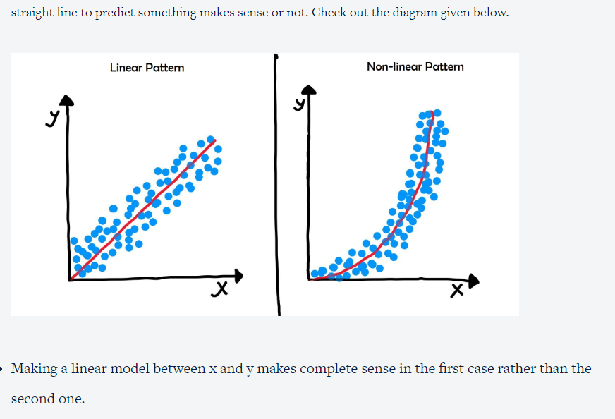

Distribution Plots:

import warnings 
warnings.filterwarnings("ignore")

inp1.ratings.plot.hist()
import seaboarn as sns

So, you have plotted a distribution plot to check the distribution of ratings using both the Matplotlib function and the Seaborn functions. In the latter case, you must have noticed that instead of the hist command, you are now using a distplot or a distribution plot.The corresponding Seaborn command is sns.distplot(inp1.Rating). 
You can go through distplot’s documentation here to learn more about the various parameters that can be used. Notice that this view is quite different from the histogram plot that we had obtained earlier in Matplotlib.

The difference arises due to the fact that instead of calculating the ‘frequency’, the distplot in Seaborn directly computes the probability density for that rating bucket. And the curve (or the KDE as noted in the documentation for Seaborn) that gets drawn over the distribution is the approximate probability density curve.*

Coming back to the visualisation, the bars that get plotted in both the cases are proportional. For example, the maximum frequency occurs around the 4-4.5 bucket in the histogram plotted by matplotlib. Similarly, the maximum density also lies in the 4-4.5 bucket in the distplot.

 

The advantage of the distplot view is that it adds a layer of probability distribution without any additional inputs and preserves the same inter-bin relationship as in the Matplotlib version. This statistical view of things is also far more informative and aesthetic than the earlier one.

 

You are expected to go through the Seaborn documentation from the link given above and answer the following questions.

In the next video, you will learn about various customisations that can be performed in a seaborn distplot.

So, after changing the number of bins to 20, you were able to observe that most of the ratings lie in the 4-5 range. This is quite a useful insight, which highlights the peculiarities of this domain, as mentioned by Rahim. If people dislike an app, they don’t generally wait to give it bad ratings; rather, they go ahead and remove it immediately. Therefore, the average ratings of the apps are pretty high.

 

Also, you learnt about some more customisations that can be done on the same view. You can change the colour of the view and even use Matplotlib functionalities on top of Seaborn to make your graphs more informative. 

[Note: Some functions and plots in seaborn have deprecated in the latest version. Therefore you may not get exactly the same visualisation as the ones shown in the video]

 

So after the data handling tasks, you went ahead and plotted the total number of records in each category of Content Rating using the pie chart and the bar graph in matplotlib. 

 

You understood the reasons why a pie chart is not very much preferred in cases where there are 3 more categories to be plotted. Essentially, it is very difficult to assess the difference between the different categories when their proportions are pretty similar as seen in the following pie chart:

 

However, this problem is easily overcome with the bar graph, where there are clear visual cues with the length of the bars that portray the difference between the categories succinctly. In fact, you can draw a horizontal bar graph as well to make the difference much more apparent. Both the views are shown in the images below

 

You can clearly see that ‘Everyone’ category has the highest number of apps followed by Teen and Mature 17+.

Question 1/1

Applications of scatter plots in machine learning
Even though you’ll be learning about them in greater detail in future modules, it is good to know certain use cases where a scatter plot is immensely productive in the field of machine learning:

Observing trends between numeric variables: Because scatter plots can reveal patterns in the data, they’re a necessity in linear regression problems where you want to determine whether making a linear model, i.e. using a straight line to predict something makes sense or not. Check out the diagram given below.

Making a linear model between x and y makes complete sense in the first case rather than the second one.
 

Observing natural clusters in the data: In simple terms, clustering is the act of grouping similar entities to clusters. For example, let’s say you have a group of students who have recently taken a test in Maths and Biology. Plotting a scatter plot of their marks in the two subjects reveals the following view:

 