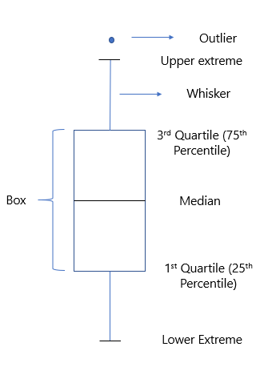
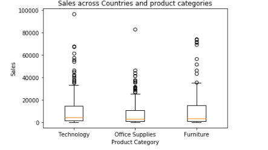

Box Plot
Box plots are quite effective in summarising the spread of a large data set into a visual representation. They use percentiles to divide the data range. 

The percentile value gives the proportion of the data range that falls below a chosen data point when all the data points are arranged in the descending order. For example, if a data point with a value of 700 has a percentile value of 99% in a data set, then it means that 99% of the values in the data set are less than 700.

You can use the following command to create a box plot in Python using Matplotlib:

plt.boxplot([ list_1, list_2])

 

The figure below shows a typical box plot with explanations for each element in its construction.

Box plots divide the data range into three important categories, which are as follows:

Median value: This is the value that divides the data range into two equal halves, i.e., the 50th percentile.
Interquartile range (IQR): These data points range between the 25th and 75th percentile values.
Outliers: These are data points that differ significantly from other observations and lie beyond the whiskers.

Which of the following plots can be used to show the relationship between two quantitative variables?

1. Box plot
2. Line plot
3. Scatter plot
4. Histogram

 A line plot and a scatterplot essentially plot the x-y relationship between two quantitative variables. They show how one variable changes with respect to another quantitative variable. To find a relationship using a line plot, one additional step that you have to complete is to first sort the elements of x-axis

 Deciding the Type of Plot to Use
You have some data of credit card transactions. In this data, you're trying to find transaction values that are way outside the usual data range, in order to investigate some fraud.
Which type of plot will you use in this case?

A box plot will be helpful here as it easily segregates the values as outliers.